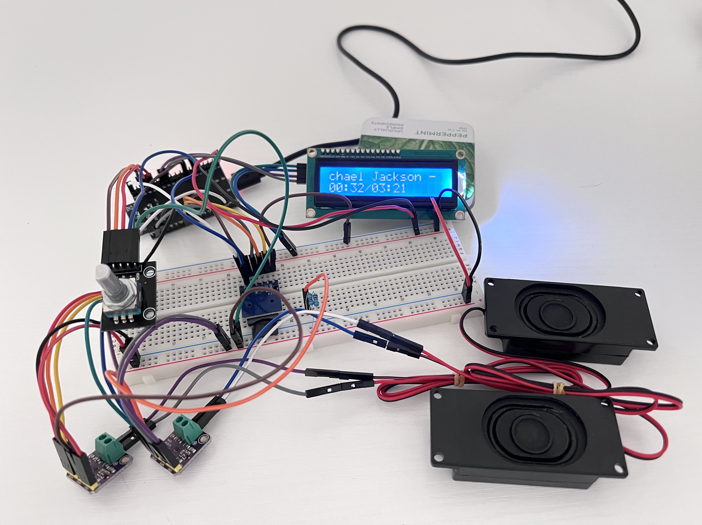

# ESP32 MP3 Player

A breadboard MP3 player, complete with a file system and a multi-function playback controller. 

## Demo
[Check it out on Youtube!](https://youtu.be/1Ke2b3DL_yw)

## Features
- High capacity storage support (64GB+)
- MP3 file system for singles/albums
- Play/pause, next song, return, and volume control

## How it works

### File system
The Arduino SdFat library was used to read MP3 files stored in a microSD card. The file system  is exFAT formatted to handle large microSD sizes, since <64GB microSD cards use the older FAT32 standard.

### Audio decoding
The Arduino Audio Tools library was used to decode MP3 PCM signals into raw bitstreams sent over I2S. The bitsreams are fed into a hardware DAC/AMP module that sends the audio to stereo speakers.

### Playback
All controls are handled through a single rotary encoder that includes a built-in button. State machines are used to debounce encoder turns and detect different button presses.

## Hardware & Software
Hardware:
| Component | Part |
|:-----|:-------|
| MCU    |   ESP32-DEVKITC-VE    |
| Control    | KY-040      |
| DAC/AMP    | MAX98357a     |
| Display    | LCD1602      |
| Storage    | MicroSD      |
| Output    | Speakers      |
 

Software:
- [SdFat by Bill Greiman](https://github.com/greiman/sdfat)
- [Audio Tools by Phil Schatzmann](https://github.com/pschatzmann/arduino-audio-tools/tree/main) 